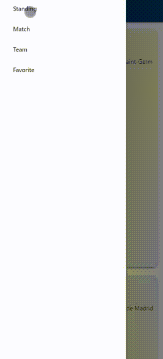

## Football PWA
Progressive Web App about UEFA Champion League built using JS, Webpack, IndexedDB, Workbox, and Firebase Cloud Messaging.

## Features
* Showing list of standings, matches, teams, and favorites
* Manage favorite teams
* Offline support through caching
* Push notification

## Resources
https://www.football-data.org

## Demo
* [Football PWA](https://football-api-46918.firebaseapp.com/)

 

  
  

 
